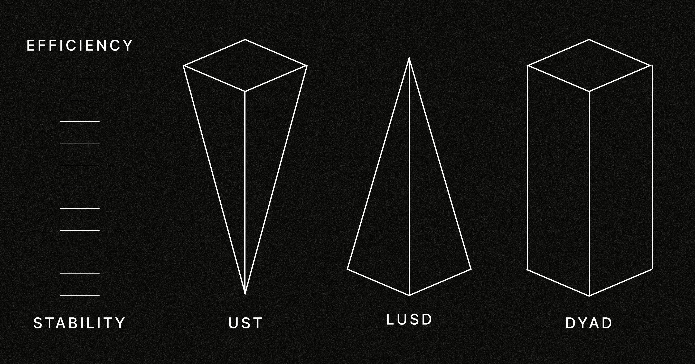
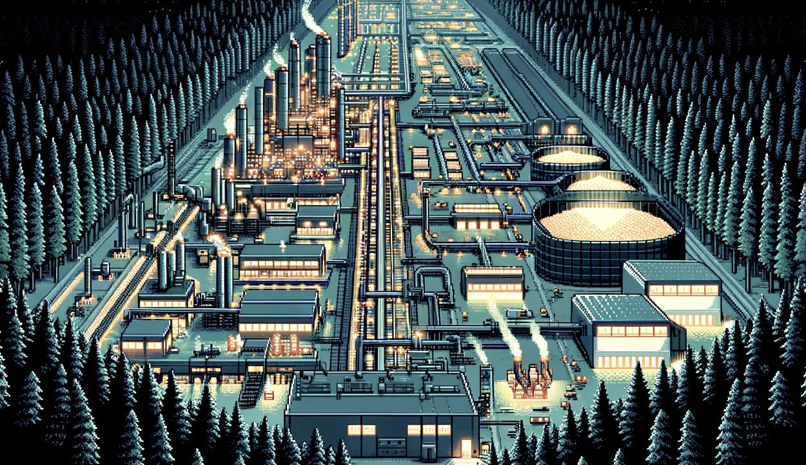
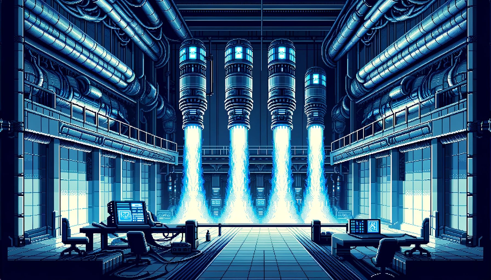

# Introduction

We need a decentralized stablecoin that prints without blowing up in challenging conditions.

That’s it. Simple, but nobody has done it.

Here’s why DYAD is that stablecoin:

The key is Kerosene, a new kind of endogenous collateral whose value is set not by the market, but by the amount of EXOGENOUS collateral, like wETH, stETH, and LRTs backing each DYAD stablecoin. This distinction makes all the difference.

The greater DYAD’s backing and the more Kerosene you deposit, the lower your cost to mint DYAD. That’s because each Kerosene token entitles you to mint against a fraction of DYAD’s total overcollateralization, which is the surplus wETH, wstETH, LRTs etc that all users deposit.

That’s how DYAD will be able to scale like Terra with the resilience of Liquity. Kerosene doesn’t add any value to DYAD’s TVL; it allocates use of the surplus collateral to individual positions, ensuring that the surplus is always ready to absorb volatility, yet never sits idle.

$DYAD is the first capital efficient overcollateralized stablecoin.

How? We tokenize the overcollateralization surplus into a second erc20 called Kerosene.

If $LUSD had Kerosene it would free up ~$450m.

If $DAI had Kerosene it would free up ~$8.8b.

To earn Kerosene, LP DYAD, with the option to stake it soon. This is standard farming, but Kerosene is far from a standard farm token, with foundational utility from day one.

Earning and depositing Kerosene immediately increases your yield because it makes your DYAD cheaper.

Only Kerosene’s deterministic value, never its market price, counts as DYAD backing.

However, if Kerosene ever trades below its deterministic value, an arb appears to bring it back to par.

DYAD’s degree of overcollateralization therefore sets a floor for Kerosene’s market price

This completes the DYAD flywheel:

1. deposit wETH, wstETH, and soon LRTs

2. Mint and farm with DYAD for Kerosene

3. add Kerosene to your collateral basket to lower your DYAD cost

4. Profit

With everyone maximizing for #4, DYAD becomes the unyielding stablecoin that yields.

